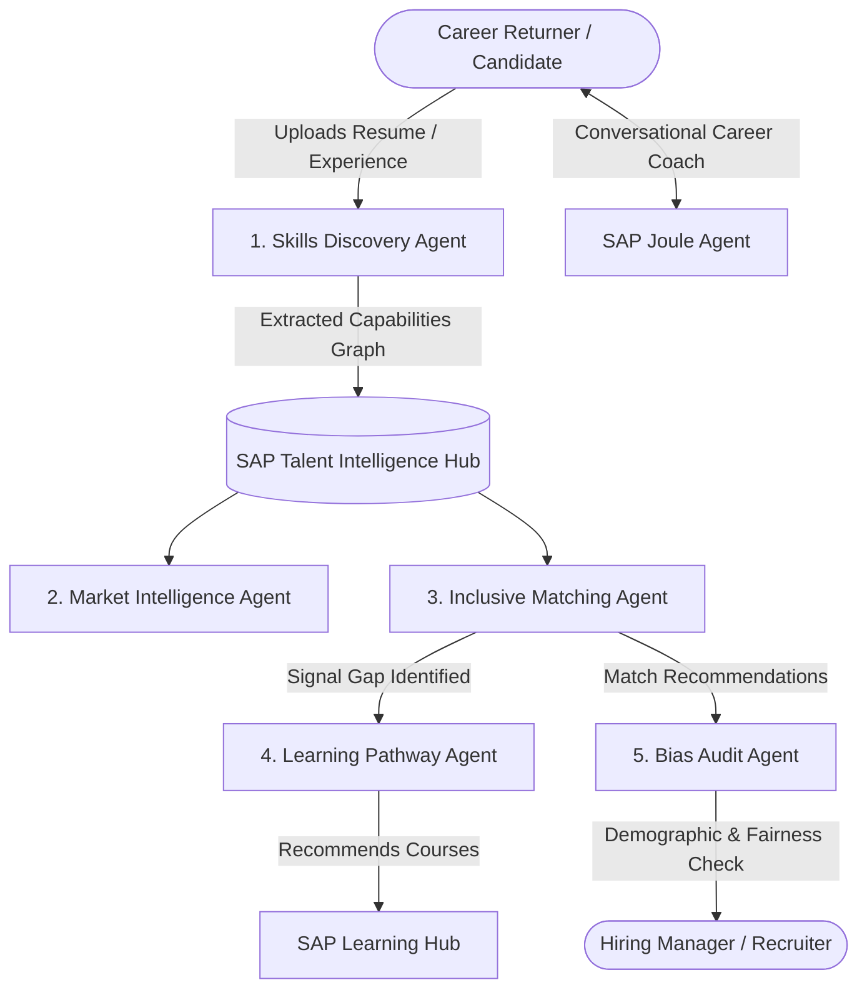

# SAP HackFest 2026 — Theme 2: Agent Architecture & Tech Strategy

## 1. Hackathon Rules Breakdown: Can You Use 3rd-Party APIs?

From the official SAP HackFest 2026 guidelines for **Theme 2 (Inclusive Workforce)**:

> *"Round 2: Using vibe coding and AI frameworks, teams build a functional prototype of at least one agent... and showcase the complete career orchestrator... leveraging SAP technologies."*

### The Direct Answer:
* **YES, you can use 3rd-party LLM APIs** (such as Gemini, OpenAI, Claude, or standard agent frameworks like LangChain) to power the reasoning engine of your agents.
* **Why?** SAP hackathons evaluate your **system architecture, domain alignment (SuccessFactors & Joule), problem-solving, and live demo execution**. 
* **Your SAP Technology Proof Points:**
  1. 🌐 **Hosted Live on SAP BTP Cloud Foundry** (`https://returnpath-ai.cfapps.ap21.hana.ondemand.com`) — *Already Done!*
  2. 🧠 **Grounded in SAP SuccessFactors Architecture** (Talent Intelligence Hub, Growth Portfolio, Skills Ontology).
  3. 🎓 **Integrated with SAP Learning Hub (Student Edition)** for personalized bridge learning modules.
  4. 🤖 **Modeled on the SAP Joule Agent Framework** (multi-agent orchestration with human-in-the-loop governance).

---

## 2. The 5 Required Agents to Build

### Agent 1: Skills Discovery Agent
* **Role**: Ingests non-traditional resumes, freelance work, caregiving gaps, and project portfolios.
* **Capability**: Infers capability signals instead of filtering by pedigree or gap length.
* **Output**: Verified competencies mapped to the interactive "Skill Galaxy" node graph.

### Agent 2: Inclusive Matching Agent
* **Role**: Evaluates candidate capability against job requisitions.
* **Capability**: Actively discounts gap duration and institution prestige. Computes semantic fit (e.g. 84% fit).
* **Output**: Transparent, explainable match breakdown showing why the candidate is qualified.

### Agent 3: Learning Pathway Agent
* **Role**: Identifies the 3-week skill gap between current state (84%) and target role readiness (91%).
* **Capability**: Curates a personalized curriculum linking directly to **SAP Learning Hub** student courses.

### Agent 4: Bias Audit Agent (Governance Layer)
* **Role**: Audits candidate recommendations for demographic, geographic, or gap-duration skew.
* **Capability**: Generates fairness reports and enforces human-in-the-loop approval thresholds for HR.

### Agent 5: Joule Career Coach (Conversational Agent)
* **Role**: Interactive assistant in the candidate workspace (`/candidate/assistant`).
* **Capability**: Guides returners through resume reframing, interview preparation, and confidence building.

---

## 3. Winning Live Demo Persona ( लखनऊ Persona from SAP Prompt)

To wow the judges, your live demo should follow the exact persona highlighted in the SAP prompt:

> **Persona: Priya Raman (28 years old, Lucknow)**
> * **Background**: 3-year caregiving career break.
> * **Challenge**: Traditional ATS filters reject her due to the 3-year chronology gap.
> * **ReturnPath AI Journey**:
>   1. **Skills Discovery Agent** analyzes her past projects & informal learning, extracting a 91% verified capability score.
>   2. **Inclusive Matching Agent** matches her to a *Product Operations Lead* role at *SAP Labs* with 84% base fit.
>   3. **Learning Pathway Agent** generates a 3-week bridge course via *SAP Learning Hub* to reach 91% readiness.
>   4. **Bias Audit Agent** confirms her profile was evaluated with 0% penalty for her career break.
>   5. **Joule Assistant** helps her prep for the SAP Labs hiring team conversation.

---

## 4. Technical Implementation Options for the Agents

| Option | Tech Stack | Setup Time | Pros |
|---|---|---|---|
| **Option A: Gemini / OpenAI (Recommended)** | Google Gemini / OpenAI + TypeScript backend on SAP BTP | **~30 mins** | Ultra fast, zero setup hassle, reliable live demo response times |
| **Option B: SAP Cloud SDK for AI** | `@sap-ai-sdk/orchestration` + SAP AI Core | **~2-3 hours** (Requires active SAP AI Core BTP instance) | Direct SAP AI SDK imports |

> **Strategy:** Build with **Option A** right now so your agents are 100% working live on SAP BTP today. You can mention in your architecture slide that the agent orchestration layer is ready to bind to SAP AI Core / Joule Studio.
